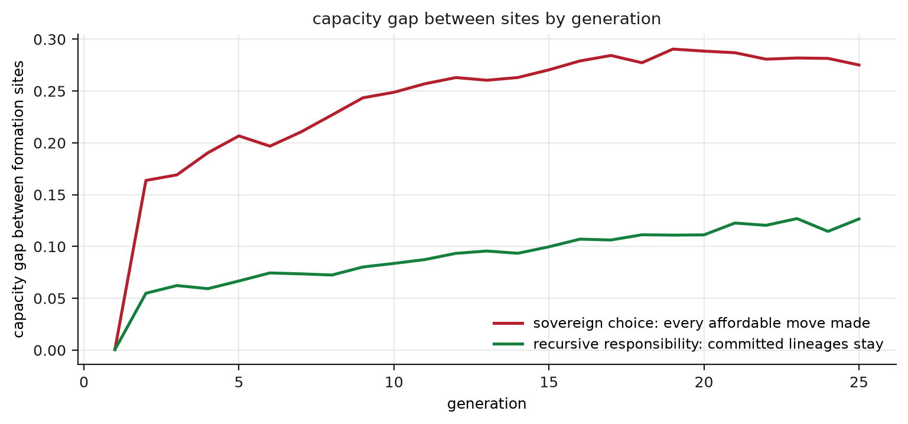
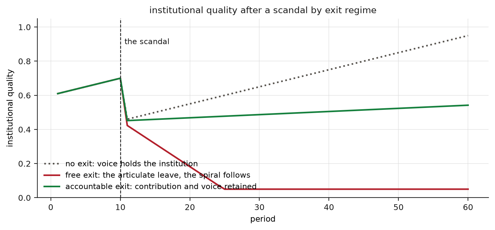

## Abstract

The modern exit from guardianship produced an unintended figure, the sovereign chooser, whose capacities, preferences and options were formed by institutions and technical systems absent from the chooser's self-description. We name a position beyond both the ward and the sovereign. Allelonomy, from Greek *allelon* (one another) and *nomos* (law), is self-rule through one another: the capacity of distinct persons to govern themselves through reciprocal, contestable and non-dominating relations that also help form them. Because cartels are also mutually dependent, we specify four conditions and test each in simulation by deleting it. In a two-site formation loop, mild private preference for better peers stratifies capacities with no planner, reaching a gap of 0.28 by generation 25; a standing commitment by part of the advantaged to stay reduces the gap to 0.13 at a cost of 0.04 per committed family per generation. In an institution maintained by the voice of its articulate members, free exit after a scandal removes those members and quality falls from 0.6 to a floor of 0.05; forbidding exit holds quality at 0.95, and accountable exit, which keeps 0.6 of a leaver's contribution and voice attached, stabilizes it at 0.54 while 17 of 100 members leave. In an epistemic model, deference scores 0.9 under an honest institution and 0.35 under a captured one, solitary research 0.62 in both, and herding matches deference; pooling 21 independent signals with audits scores 0.9 and 0.77, and returns to 0.35 when the institution can suppress the pool.

## Introduction

A patient refuses a treatment because a video contradicted the physician. A parent moves a child to a better school and regards the aggregate result, a sorted city, as nobody's doing. A citizen asks why obligations they never signed should bind them, while living inside a security order, a currency and a language they did not build. We call the figure in these scenes the produced sovereign: a person whose capacities were cultivated by schools, whose preferences were patterned by class position, whose attention is curated by software and whose knowledge consists mostly of testimony, and who has learned to describe this ensemble as self-authorship, so that every dependence appears as an insult and every shared claim as a trespass.

The produced sovereign does not see a loop. Conditions of formation produce capacities for judgment; capacities issue in choices; choices aggregate into sorting; and sorting becomes the next generation's conditions of formation. Accounts of sovereign choice keep the middle term and omit the links on both sides. Correcting that omission does not require a return to guardianship. Between the ward, who is governed through dependencies they cannot contest, and the sovereign, who denies that dependence has any claim, lies a third position, which we name allelonomy and define with four conditions tested in simulation.

## Enlightenment and relational autonomy

Kant defined immaturity as the inability to use one's own understanding without another's guidance, called it self-incurred where it rests on lack of courage and not of understanding, and issued the imperative *sapere aude* (Kant, 1784). The exit from tutelage is the founding scene of the modern person, and nothing here retracts it. The scene never contained a solitary thinker, however. Kant's essay ties enlightenment to the public use of reason, argument addressed to a reading public; the capacity to judge is cultivated by teachers, exercised in languages no one invented alone, and checked against others. The relational-autonomy literature made the point systematic: the competencies that constitute autonomy, including self-trust, self-knowledge and the ability to weigh reasons, develop and persist within relations and institutions, which can sustain them or destroy them (Mackenzie and Stoljar, 2000). The relevant question is therefore which kind of dependence a person has, whether it produces a capable judge or a subordinate.

## From self-government to sovereignty

The movement from the Enlightenment's self-governing person to the contemporary sovereign chooser has identifiable stages. Mill's harm principle drew a boundary around the individual within which society has no jurisdiction (Mill, 1859), a defensible protection that later readers inflated into a picture of the person as a bounded realm generating its own law. The claim of self-government became a claim of final jurisdiction, and that became a claim of exemption, the right to decide for oneself when shared rules and shared facts apply. The last step follows the logic of political sovereignty as the power to decide the exception, with each person treated as a small state entitled to suspend the common order at its border.

The republican tradition had already rejected the equation of freedom with this kind of mastery. Arendt argued that freedom exists only among plural agents and that sovereignty, mastery over the conditions of action, is unavailable to any acting being, since action always enters a web of other actors (Arendt, 1961). Pettit relocated unfreedom from interference to arbitrary power: a person is unfree when another holds uncontrolled power over their conditions of action, and free when that power is checked, whether or not it is exercised (Pettit, 1999). Balibar's equaliberty binds liberty to the equal capacity of others to exercise and contest it (Balibar, 2014). All three place freedom inside relations and treat sovereignty as the unattainable aim of a position outside them.

## The social production of the chooser

The history the sovereign omits is documented. Foucault's account of subjectivation describes how institutions produce subjects who then experience themselves as prior to institutions (Foucault, 1982). Bourdieu's habitus treats preference as a deposit: the tastes, aspirations and sense of the possible that a class position lays down, which then issue in free and predictable choices (Bourdieu, 1984). Stiegler adds a technical layer, in which memory and attention are partly externalized into inherited supports, so that a generation thinks with instruments it did not make (Stiegler, 1998). Deleuze's societies of control describe power as continuous modulation through scores, rankings, feeds and access conditions that shape conduct without commands (Deleuze, 1992). Boltanski and Chiapello traced how the anti-authoritarian critique of the 1960s was absorbed by the system it attacked and returned as the entrepreneurial self, obliged to perpetual self-management and responsible by definition for its failures (Boltanski and Chiapello, 2005). Sloterdijk's observation that humanism was always a practice of forming humans (Sloterdijk, 2009) supports one limited point: formation is universal, and the problem lies in formation that is disavowed.

None of these authors supports the inference the produced sovereign often draws from them, that because the self is produced, every institution is fraudulent and every expert exercises mere power; that inference is discussed below. The production literature establishes a narrower claim: the chooser, the options and the experience of choosing all have histories, so an analysis that begins at the moment of choice begins too late.

## Model design

The claims about the loop can be simulated in three domains. All numbers below are properties of the model; none is an empirical estimate. In the first model, 1000 agents live in two developmental sites; parents choose sites with a mild preference for better peers, subject to affordability; and children's capacities are formed 0.55 by their parent and 0.45 by their site, plus noise. In the second, an institution's quality is maintained by the voice of its 30 most articulate members against constant decay, funding follows enrollment, and a scandal at period 10 reduces quality by 0.25. In the third, agents form beliefs about questions of fact under an expert institution that is right 0.9 of the time when honest and 0.35 when captured, with private research right 0.62 of the time and a pool of 21 potential independent signals.

## Sorting and the formation loop

Schelling showed that mild local preferences, with no one wanting more than a modestly better neighbourhood, generate strong aggregate segregation that no participant intends (Schelling, 1971). The formation model adds a developmental link: the sites into which people sort also form the next generation's capacities. Under sovereign choice, with every affordable move toward better peers taken, the capacity gap between the sites grows from zero to 0.28 in 25 generations. There is no planner, no change in law and no discrimination. The sorting is the sum of reasonable private acts, and it stratifies capacities themselves, which then drive the next round of sorting.

Young's social connection model describes responsibility in such a structure: where injustice results from the ordinary, lawful acts of many connected participants, responsibility does not require a guilty author and falls, in a forward-looking and political form, on those whose practices reproduce the outcome (Young, 2006). The model assigns a price to this responsibility. In the allelonomic regime, 0.6 of advantaged lineages commit to stay, and the final gap falls to 0.13, a factor of 2.2. The commitment costs its bearers 0.04 of formation per family per generation in forgone peer advantage for their own children. The sovereign regime thus stratifies a society without any villain, and the remedy requires families to give up part of their own children's advantage for the benefit of others'.

{width=100%}

## Exit, voice and institutional decline

Hirschman's triad organizes the second model: members of a declining institution can exit or exercise voice, and exit by those best able to use voice can remove the feedback the institution needs (Hirschman, 1970). After the scandal, quality falls below the standard at which resourced members leave. Under free exit, the 34 members who can afford alternatives leave; they are also the articulate members, so voice falls to zero, funding follows enrollment, and quality falls from 0.6 to the floor of 0.05, where it remains for the 66 members who could not leave. Each exit was a reasonable individual act, and the aggregate is an abandoned institution.

Two comparison regimes locate a remedy. Forbidding exit holds quality at 0.95, since voice keeps working, at the price of making members wards of the institution, whose vulnerability appears in the epistemic model below. Accountable exit permits leaving while keeping 0.6 of a leaver's contribution and voice attached, much as a family that changes schools remains part of the school system's tax base and politics. Under this regime 17 members leave and quality stabilizes at 0.54. Exit that remains answerable to the institution it leaves preserves both choice and the institution.

{width=100%}

## Epistemic dependence and its conditions

The produced sovereign's central conviction is epistemic: the belief that one has looked into the matter oneself. Hardwig showed that this posture misdescribes science itself, since a rational epistemic life consists largely of justified dependence on others who know what one cannot check (Hardwig, 1985), and Polanyi showed that much expert knowledge is tacit and cannot be stated in propositions a layperson could audit (Polanyi, 1966). The infrastructure of a modern belief (instruments, archives, peer networks, platforms and their rankings) is invisible in the first person, so the solitary researcher experiences its outputs as personal findings. Latour described how critical techniques built to show that facts are constructed were repurposed to argue that constructed means false, so that identifying the institution behind a claim came to count as refuting it (Latour, 2004). Nguyen's echo chambers pre-emptively discredit contrary voices, so that exposure to rebuttal increases members' confidence (Nguyen, 2020). The solitary researcher who believes they are escaping manipulation often encounters it, since organized interests manufacture doubt, a documented practice from tobacco to climate (Oreskes and Conway, 2010).

The epistemic model summarizes the problem in eight numbers. The ward, adopting the institution's answer, scores 0.9 under an honest institution and 0.35 under a captured one, so deference follows its institution into error; this is the legitimate core of the sovereign's suspicion. The solitary researcher scores 0.62 in both conditions, immune to capture and mediocre everywhere. The herd, in which everyone defers to the loudest source, reproduces the ward's 0.9 and 0.35, so interdependence as such confers nothing. The allelonomic configuration combines three conditions. Under distinction, 21 members keep independent private signals, whose pooled majority is right 0.87 of the time. Under contestability, an audit with sensitivity 0.8 is triggered when the pool disagrees with the institution. Under non-domination, the institution cannot suppress the pool. The result is 0.9 under honesty and 0.77 under capture, with almost nothing lost in the honest condition and most of the loss recovered under capture. If non-domination is deleted, so that the institution can silence its auditors, the same architecture scores 0.35 under capture, equal to the ward. The conditions are jointly necessary.

These numbers correspond to O'Neill's argument that the proper aim is trustworthiness and not trust (O'Neill, 2002), to Longino's account of objectivity as organized criticism (Longino, 1990), and to Collins and Evans's view that expertise is real and unequally distributed and needs institutions that neither level it nor place it beyond challenge (Collins and Evans, 2002). Fricker's analysis applies to the pool itself: whose signals are counted and whose are discounted in advance is a question of justice within epistemic institutions, since credibility can be systematically misassigned (Fricker, 2007). The resulting politics of knowledge requires institutions that are accurate when honest, exposable when captured, and unable to silence those who would detect capture.

{width=100%}

## Clinical care

Medicine is where the ward and the sovereign meet most often. Mol's ethnography of diabetes care found that the consumer frame of options presented and preferences exercised misdescribes good treatment, which is iterative, collaborative, materially embedded and revised as bodies respond; the relevant question is which arrangement allows good knowledge and good adjustment to emerge over time (Mol, 2008). Kittay grounds the point in the human condition: dependency is its baseline, bracketed by infancy and old age and present throughout, sustained by labour that the sovereign self-description renders invisible (Kittay, 1999). The market frame also fails on its own terms, since transactions between unequally informed parties do not behave as the sovereign-consumer picture assumes, and the clinic is an extreme case of asymmetric information (Stiglitz, 2002).

In the clinic, the physician holds causal knowledge the patient cannot audit, and the patient holds first-person knowledge and authority over which burdens to accept. The relation works when asymmetric competence is combined with equal standing, each party able to correct the other within its own domain: epistemic asymmetry without political subordination.

## Definition of allelonomy

The word has a prior use. Naniwada used allelonomy for the mutual dependence of things, against the picture of reality as a collection of separate autonomous entities (Naniwada, 1993). The Greek places *allelon*, one another, where autonomy has *autos*, the self. The prior use does not distinguish dependence that emancipates from dependence that absorbs, a gap the herding result demonstrates, since a caste order, an abusive marriage and a conspiracy network are all mutually dependent. We therefore define the term by four conditions, each tested by deletion. Distinction: persons remain independent centres of judgment; without it the pool becomes a herd. Contestability: the relations and institutions that form people are open to challenge and revision; without it the audit never fires. Non-domination: no party holds uncontrolled power over the conditions of another's agency; without it the suppressed pool changes nothing. Recursive responsibility: agents answer for what their aggregated choices reproduce; without it the formation loop stratifies. Allelonomy is constitutive dependence made visible, contestable and jointly governed.

Related terms fit less well. Relational autonomy is correct but names a corrective and not a position. Coauthorship overstates intention, since language, biology and aggregate effects shape persons without anyone authoring them. Illich's conviviality, individual freedom realized in personal interdependence, is close but suggests a harmony that a concept centred on contestation should not imply (Illich, 1973). The institutional side of allelonomy exists in parts: Castoriadis's autonomous society, which understands its institutions as its own revisable creations and questions them explicitly (Castoriadis, 1987); Dewey's public, formed by the consequences of transactions and constituted by organized inquiry into them (Dewey, 1927); and Ostrom's polycentric governance, self-rule by neither a single centre nor an atomized market (Ostrom, 1990). Each describes order produced among its subjects, revisable by them and owned by none of them.

The resulting triad can be stated in full. Under heteronomy, another governs me, and the dependencies cannot be contested. Under sovereign autonomy, I govern myself and dependence has no legitimate claim; because this self-description is false, the dependencies govern unacknowledged, which reproduces heteronomy. Under allelonomy, people become capable of self-government through one another, and the relations that make them capable are themselves under joint, contested and revisable government. A person in this position defers without surrendering judgment, contests institutions without concluding that they are fraudulent, answers for what the choices of many similar people reproduce, and examines their own formation instead of denying it.

## Objections

The conformity objection holds that a self governed through others dissolves into them. In the epistemic model the regime without distinction, the herd, performs worst, and the allelonomic regime outperforms it by keeping each member's signal independent. Allelonomy requires independent individuals and organizes their disagreement, and a consensus reached too easily is evidence against the process that produced it.

The expertise objection holds that treating doctor and patient, or climatologist and commentator, as equals would be an epistemic disaster. Allelonomy does not treat them as equals. The allelonomic configuration preserves asymmetric competence, defers to it at full accuracy while the institution is honest, and adds only the machinery that detects capture. In the model, deference with audit outperforms both blind deference and universal suspicion.

The novelty objection holds that allelonomy is relational autonomy renamed. Relational autonomy describes how autonomy is socially constituted; allelonomy adds the government of the constituting relations, the four conditions, and their joint necessity, which the deletions test separately. The term is proposed because it holds together claims that otherwise appear separately.

The cost objection holds that the responsibility condition asks the advantaged to give up part of their children's advantage and that few will. The model does not predict whether they will; it shows what the payment buys, a halving of the stratification of formation, and reports its price.

## Conclusion

The ward is governed through dependencies they cannot contest. The sovereign denies that dependence has any claim and is governed through dependencies anyway, without acknowledging them. The allelonomic person is formed and helps form others, depends on others and helps govern those dependencies, and keeps the conditions of their own capability open to question. Kant's imperative remains in force and gains a second clause: use your own understanding, and know what built it, who maintains it, and what your uses of it, summed with everyone else's, will produce.

## Reproducibility

The simulation, its three figures and every model number quoted above regenerate from one command in the repository (`simulation/run_all.py`; seeded, bit-for-bit reproducible). Thirteen invariants fail the run if broken, among them stratification without a planner, the nonzero price of the responsibility commitment, the exit spiral and its stabilization under accountable exit, the ward's collapse under a captured institution, the herd's reproduction of the ward's numbers, the allelonomic configuration's survival of capture, and the loss of that survival when non-domination is deleted.

## References

Arendt, H. (1961). What is freedom? In *Between Past and Future: Six Exercises in Political Thought*. New York: Viking Press.

Balibar, É. (2014). *Equaliberty: Political Essays*. Trans. J. Ingram. Durham: Duke University Press.

Boltanski, L., and Chiapello, È. (2005). *The New Spirit of Capitalism*. Trans. G. Elliott. London: Verso.

Bourdieu, P. (1984). *Distinction: A Social Critique of the Judgement of Taste*. Trans. R. Nice. Cambridge, MA: Harvard University Press.

Castoriadis, C. (1987). *The Imaginary Institution of Society*. Trans. K. Blamey. Cambridge, MA: MIT Press.

Collins, H. M., and Evans, R. (2002). The third wave of science studies: studies of expertise and experience. *Social Studies of Science*, 32(2), 235--296.

Deleuze, G. (1992). Postscript on the societies of control. *October*, 59, 3--7.

Dewey, J. (1927). *The Public and Its Problems*. New York: Henry Holt.

Foucault, M. (1982). The subject and power. *Critical Inquiry*, 8(4), 777--795.

Fricker, M. (2007). *Epistemic Injustice: Power and the Ethics of Knowing*. Oxford: Oxford University Press.

Hardwig, J. (1985). Epistemic dependence. *The Journal of Philosophy*, 82(7), 335--349.

Hirschman, A. O. (1970). *Exit, Voice, and Loyalty: Responses to Decline in Firms, Organizations, and States*. Cambridge, MA: Harvard University Press.

Illich, I. (1973). *Tools for Conviviality*. New York: Harper and Row.

Kant, I. (1784). Beantwortung der Frage: Was ist Aufklärung? *Berlinische Monatsschrift*, 4, 481--494.

Kittay, E. F. (1999). *Love's Labor: Essays on Women, Equality, and Dependency*. New York: Routledge.

Latour, B. (2004). Why has critique run out of steam? From matters of fact to matters of concern. *Critical Inquiry*, 30(2), 225--248.

Longino, H. E. (1990). *Science as Social Knowledge: Values and Objectivity in Scientific Inquiry*. Princeton: Princeton University Press.

Mackenzie, C., and Stoljar, N. (eds.) (2000). *Relational Autonomy: Feminist Perspectives on Autonomy, Agency, and the Social Self*. New York: Oxford University Press.

Mill, J. S. (1859). *On Liberty*. London: John W. Parker and Son.

Mol, A. (2008). *The Logic of Care: Health and the Problem of Patient Choice*. London: Routledge.

Naniwada, H. (1993). A Japanese perspective of the transformation of modern civilizations. In P. M. Minus (ed.), *The Ethics of Business in a Global Economy*. Dordrecht: Kluwer, 153--171.

Nguyen, C. T. (2020). Echo chambers and epistemic bubbles. *Episteme*, 17(2), 141--161.

O'Neill, O. (2002). *A Question of Trust: The BBC Reith Lectures 2002*. Cambridge: Cambridge University Press.

Oreskes, N., and Conway, E. M. (2010). *Merchants of Doubt: How a Handful of Scientists Obscured the Truth on Issues from Tobacco Smoke to Global Warming*. New York: Bloomsbury Press.

Ostrom, E. (1990). *Governing the Commons: The Evolution of Institutions for Collective Action*. Cambridge: Cambridge University Press.

Pettit, P. (1999). *Republicanism: A Theory of Freedom and Government*. Oxford: Oxford University Press.

Polanyi, M. (1966). *The Tacit Dimension*. Garden City: Doubleday.

Schelling, T. C. (1971). Dynamic models of segregation. *The Journal of Mathematical Sociology*, 1(2), 143--186.

Sloterdijk, P. (2009). Rules for the human zoo: a response to the Letter on Humanism. *Environment and Planning D: Society and Space*, 27(1), 12--28.

Stiegler, B. (1998). *Technics and Time, 1: The Fault of Epimetheus*. Trans. R. Beardsworth and G. Collins. Stanford: Stanford University Press.

Stiglitz, J. E. (2002). Information and the change in the paradigm in economics. *American Economic Review*, 92(3), 460--501.

Young, I. M. (2006). Responsibility and global justice: a social connection model. *Social Philosophy and Policy*, 23(1), 102--130.
